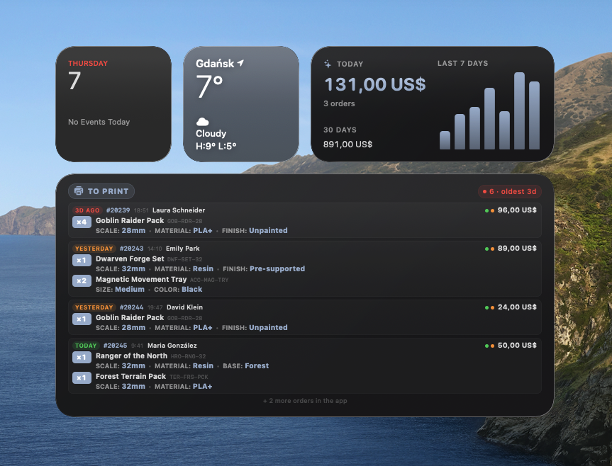
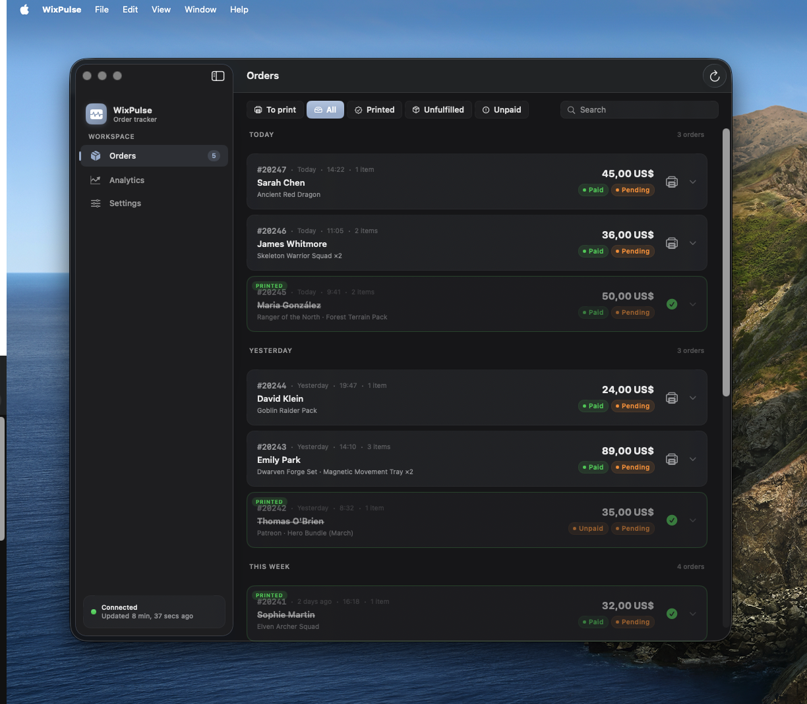
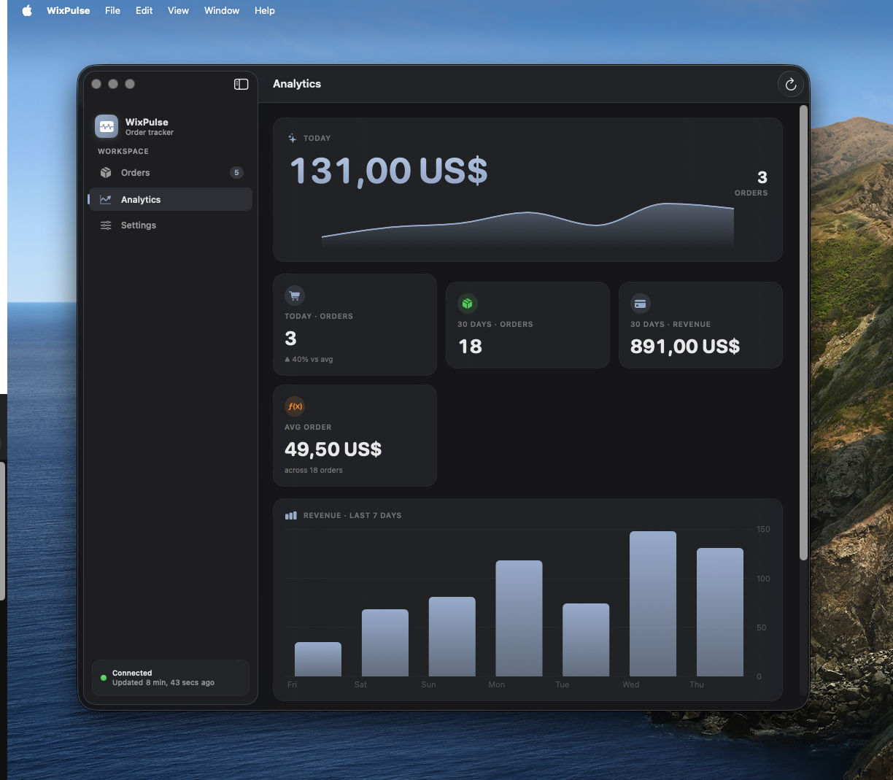
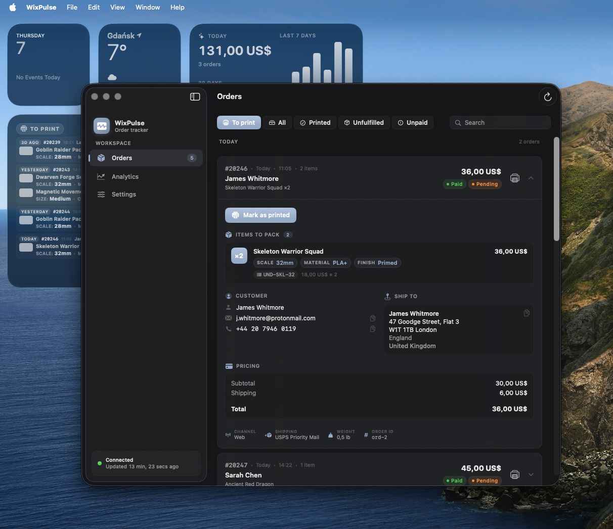
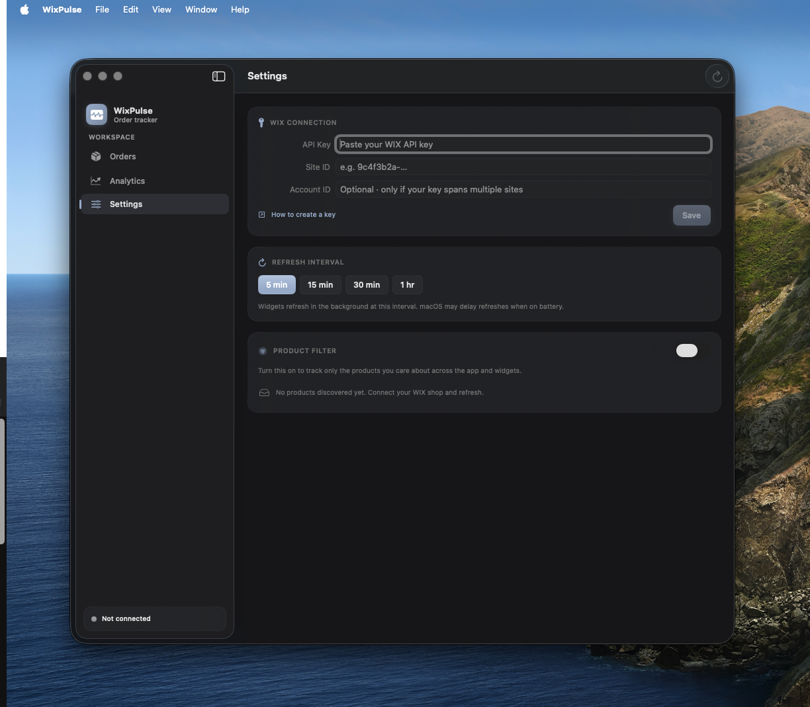

# WixPulse

A native macOS app and desktop widgets that turn a [Wix](https://www.wix.com/) shop's order feed into a fulfillment-ready production queue. Built with SwiftUI + WidgetKit + Swift Charts. The API key never leaves the device — it's stored in the macOS Keychain and the widgets read only locally-cached snapshots.

   

> Built originally to run a small 3D-printing fulfillment workflow for a Wix shop — the operator opens the laptop, glances at the desktop widget, prints the next item, marks it done, and the queue updates everywhere instantly.

## Screenshots

<p align="center">
  
  <em>Recent Orders and WIX Analytics widgets pinned to the desktop, alongside macOS native widgets.</em>
</p>

<table>
  <tr>
    <td width="50%"></td>
    <td width="50%"></td>
  </tr>
  <tr>
    <td align="center"><b>Orders</b> — production queue with To-print / Printed / Unfulfilled / Unpaid filters and oldest-first sorting.</td>
    <td align="center"><b>Analytics</b> — today's revenue hero, 30-day metrics, and a 7-day Swift Charts breakdown.</td>
  </tr>
  <tr>
    <td width="50%"></td>
    <td width="50%"></td>
  </tr>
  <tr>
    <td align="center"><b>Order detail</b> — every order expands into a full fulfillment slip: line items with × qty / SKU / variant attributes, customer block with copy-to-clipboard email and phone, shipping label, and a receipt-style pricing breakdown.</td>
    <td align="center"><b>Settings</b> — API key stored in Keychain, refresh interval, and a product filter that scopes both app and widgets to the SKUs you care about.</td>
  </tr>
</table>

> The screenshots above are rendered with seed data from the [`screenshots-mock`](https://github.com/krzysztofkotlowski/wix-pulse/tree/screenshots-mock) branch (a fictional tabletop-miniatures studio). The `main` branch hits the real Wix REST API.

## Features

### Production queue (the main loop)
- **"To print" widget** (Small / Medium / Large / Extra Large) — shows only the orders that still need to be printed and shipped, sorted **oldest-first** so the queue is FIFO. Filters out anything already printed, fulfilled, canceled, or older than 14 days.
- **Mark as printed** — one-click action on every order card (in the app) or in the expanded detail. Printed orders disappear from the widget queue immediately and the sidebar badge updates.
- **Smart staleness warning** — the widget header chip turns orange when the oldest pending order is ≥1 day old, red when ≥3 days. Catches forgotten orders without the operator opening the app.
- **Per-item production detail** — each order in the Large widget shows the quantity badge, color/variant, model identifier, SKU, and structured attributes (Size, compatibility, options) parsed out of Wix's `descriptionLines`. Enough info to print without opening anything.

### Order management
- **Operator-grade detail view** — click any order in the app to expand: full line-items table with × quantity badges, variant info, SKUs, unit price; customer block with copy-to-clipboard email and phone; address rendered as a real shipping label; pricing receipt; buyer notes in a callout; and a meta footer with channel / weight / order ID.
- **Status filters** — `To print`, `All`, `Printed`, `Unfulfilled`, `Unpaid`. Search by order number, customer name, email, or product name.
- **Date grouping** — orders grouped by Today / Yesterday / This week / Earlier with relative date labels ("3 days ago", "Apr 28").
- **Product filter** — Settings discovers every product from your recent orders, ranked by frequency. Pick the ones you care about and both the app and widgets show only those.

### Analytics
- **Hero card** — today's revenue as a large rounded numeral with a sparkline of the past 7 days.
- **Metric grid** — today's orders, 30-day orders, 30-day revenue, average order value, with pace indicators (▲ N% vs avg).
- **Charts** — bar chart of revenue, line+area chart of orders, both Swift Charts.
- **Site traffic** — sessions and unique visitors for today and the last 30 days, plus a 30-day sessions chart. Pulled from Wix's Analytics Data API. Requires the `Read Site Analytics` permission on your API key; if missing, the Analytics tab shows a friendly hint card linking to the Wix dashboard.
- **Analytics widget** (Small / Medium / Large / Extra Large) for at-a-glance numbers on the desktop. Medium and Large variants surface today's sessions / visitors alongside revenue.

### Social presence
- **Instagram follower tracker** — add your handle in Settings, the app records a daily snapshot of your follower count and shows it on the Analytics tab as a card with a 90-day sparkline and week-over-week delta.
- **Auto + Manual modes** — auto-fetch via Instagram's public web profile endpoint when it works; if Instagram blocks the request (rate limits in 2026 are aggressive), the row exposes a manual count input so you can keep history accurate from your phone in seconds. Designed to be expanded to Twitter/X, TikTok, and YouTube without UI changes.

### Quality of life
- Refined macOS-Tahoe-friendly palette — cool slate accent, charcoal surface, regular-material cards, hairline borders.
- Auto-ticking "Updated X ago" using `Text(_:style:.relative)`.
- Resilient API decoder — per-order tolerance so one malformed order doesn't kill the whole response. Cleans `"undefined"` / `"null"` strings before they hit the UI. Handles WIX's habit of returning `weightTotal` as a string and line-item images as objects.
- 20s request timeout so a stalled connection can't soft-hang the app.
- App is sandboxed with `network.client` only. App key + Site ID never leave the machine.

## Requirements

- **macOS 14 Sonoma** or later (developed on macOS 26 Tahoe)
- **Xcode 15** or later
- **[XcodeGen](https://github.com/yonaskolb/XcodeGen)** — `brew install xcodegen`
- A Wix account with an [API key](https://manage.wix.com/account/api-keys)

## Quick start

```bash
git clone https://github.com/krzysztofkotlowski/wix-pulse.git
cd wix-pulse
./scripts/bootstrap.sh    # installs xcodegen if needed, generates WixPulse.xcodeproj
open WixPulse.xcodeproj
```

In Xcode:
1. Set your **Team** in Signing & Capabilities for all 3 targets (`WixPulse`, `OrdersWidgetExtension`, `AnalyticsWidgetExtension`).
2. Select the **WixPulse** scheme, destination **My Mac**, run with `⌘R`.
3. Open the in-app **Settings** tab, paste your API key + Site ID, click **Save**.
4. Right-click your desktop → **Edit Widgets** → search **WixPulse** → drag *Recent Orders* and *WIX Analytics* widgets onto the desktop or into Notification Center.

## Getting your Wix credentials

1. Open the [Wix Dashboard → API Keys](https://manage.wix.com/account/api-keys).
2. **Generate API Key**, name it `WixPulse`, grant `Wix Stores → Read Stores` and `Wix eCommerce → Read Orders`.
3. Copy the key once shown — Wix won't display it again.
4. Find your **Site ID** in the dashboard URL: `manage.wix.com/dashboard/<SITE_ID>/...`
5. Paste both into WixPulse → Settings.

## Architecture

```
WixPulse/                                 macOS app target (SwiftUI)
└── Sources/
    ├── WixPulseApp/                      App + sidebar + Orders + Analytics + Settings + design system
    │   ├── AppStore.swift                @MainActor ObservableObject — owns snapshot, filter, printed-tracking
    │   ├── RootView.swift                NavigationSplitView with sidebar + detail + global error banner
    │   ├── OrdersView.swift              Production queue, expandable detail, mark-as-printed
    │   ├── AnalyticsView.swift           Hero card + metric grid + Swift Charts
    │   ├── SettingsView.swift            API credentials, refresh interval, product filter UI
    │   └── AppButtons.swift              ButtonStyle conformances (.wpPrimary, .wpGhost, .wpDanger, .wpIcon)
    │
    ├── WixPulseCore/                     Shared Swift Package (testable, platform-agnostic)
    │   └── Sources/WixPulseCore/
    │       ├── Models.swift              WixOrder, LineItem, Attribute, Address, Money, OrderSummary
    │       ├── WixAPIClient.swift        async/await client for /ecom/v1/orders/search with resilient decoder
    │       ├── Analytics.swift           summarize(orders:) → revenue + 7-day breakdown + most-common currency
    │       ├── ProductFilter.swift       Discovers products from line items, applies filter
    │       ├── SharedStorage.swift       UserDefaults via App Group + printed-order tracking
    │       ├── Keychain.swift            SecItem wrapper for API key
    │       ├── Refresher.swift           Actor that fetches + persists + reloads widget timelines
    │       └── Design.swift              Tokens (WP.Spacing, WP.Radius), colors, fonts, shared SwiftUI primitives
    │
    ├── OrdersWidget/                     WidgetKit extension — production queue
    │   ├── OrdersWidget.swift            WidgetBundle + TimelineProvider with print/ship filtering
    │   └── OrdersWidgetView.swift        Small / Medium / Large / Extra Large layouts
    │
    └── AnalyticsWidget/                  WidgetKit extension — revenue dashboard
        ├── AnalyticsWidget.swift         WidgetBundle + TimelineProvider
        └── AnalyticsWidgetView.swift     Small / Medium / Large with Charts + sparklines
```

**Data flow:** Main app calls Wix REST API → `Refresher` saves a `CachedSnapshot` into the App Group `UserDefaults` → widgets read from the same App Group on each timeline reload. Marking an order printed mutates a `Set<String>` in the App Group and triggers `WidgetCenter.shared.reloadAllTimelines()`. Widgets never make network calls — they work offline using whatever the app last cached.

**Why XcodeGen?** `.xcodeproj` files are XML soup that conflict on every change and bake in personal team identifiers. `project.yml` is human-readable, diffs cleanly, and is the single source of truth.

## Development

```bash
xcodegen generate                                      # regenerate .xcodeproj after editing project.yml
swift test --package-path Sources/WixPulseCore         # run core unit tests
xcodebuild -scheme WixPulse -destination 'platform=macOS' \
  -derivedDataPath /tmp/wixpulse-build build           # CLI build (avoids stomping Xcode's DerivedData)
```

## Configuration

| Item | Where | Default |
|---|---|---|
| Bundle ID prefix | `project.yml` → `bundleIdPrefix` | `com.kkotlowski.wixpulse` (change to your reverse-DNS) |
| App Group | All 3 `.entitlements` files | `group.com.kkotlowski.wixpulse` |
| Refresh interval | App → Settings | 15 min (5/15/30/60 supported) |
| Print-queue cutoff | `OrdersWidget.swift` / `OrdersView.swift` | 14 days |

> **Forking:** Search-and-replace `kkotlowski` with your own reverse-DNS prefix in `project.yml` and the three `.entitlements` files, then re-run `xcodegen generate`.

## Notes & limitations

- **Wix API key permissions.** Order data needs `Wix Stores → Read Stores` and `Wix eCommerce → Read Orders`. Site traffic additionally needs `Wix Site Analytics → Read Site Analytics` — if your key is missing it, the Analytics tab gracefully shows a hint card instead of breaking.
- **Instagram follower fetcher is best-effort.** It calls Instagram's public `web_profile_info` endpoint with a browser User-Agent. Instagram aggressively rate-limits unauthenticated traffic, so auto-fetch may fail intermittently or stop working entirely on a flagged network. The Settings UI exposes a manual override for this exact reason — type the count from your phone, the app records the daily snapshot regardless of fetch state. For high-volume or business use, switch to the official **Instagram Graph API** (Facebook business account + app review required) or a paid third-party scraping service. The current implementation is intended for personal portfolios and small shops.
- **macOS Tahoe widget tinting.** macOS Tahoe lets users render widgets in monochrome / tinted mode. The widget code uses `widgetAccentable(true)` on background shapes (not foreground text) so quantity badges, status pills, and accent surfaces stay readable in every rendering mode.
- **Widget refresh cadence.** macOS throttles widget timeline reloads, especially on battery. The app's recurring refresh loop calls `WidgetCenter.reloadAllTimelines()` every cycle as a hint, but actual on-screen updates can lag by minutes. The 5/15/30/60 min options in Settings are upper bounds, not guarantees.

## Roadmap

- [x] Site traffic in Analytics + widget
- [x] Instagram follower tracking
- [ ] Twitter/X, TikTok, YouTube follower tracking (the social model is already platform-agnostic)
- [ ] iOS app + Lock Screen widgets
- [ ] OAuth so users don't have to generate their own API keys
- [ ] Menu-bar companion mode
- [ ] CSV export of pending orders
- [ ] Per-widget product filters
- [ ] Localization (currently English/Polish-friendly)

## License

MIT © 2026 Krzysztof Kotłowski

---

WixPulse is an independent project and is not affiliated with or endorsed by Wix.com, Ltd.
